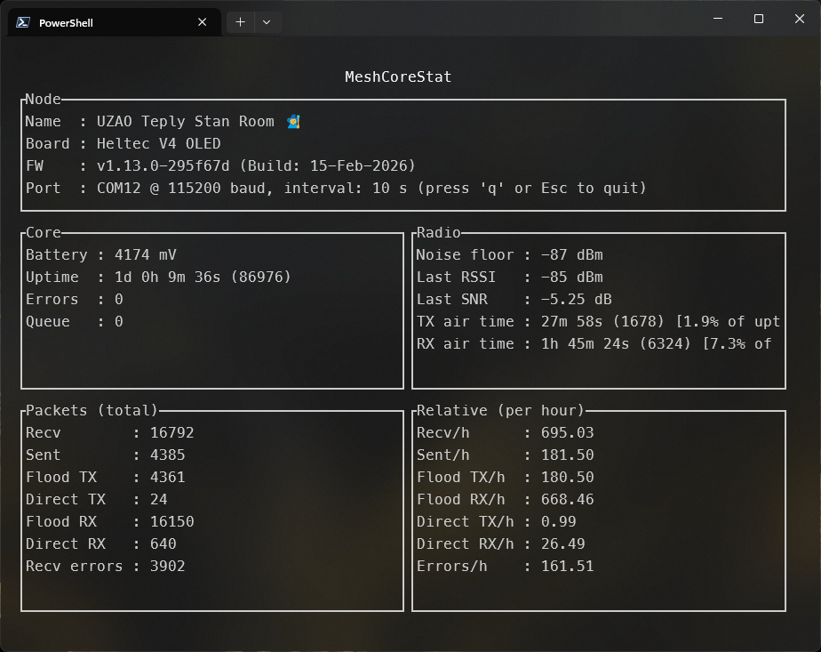

# MeshCoreStat

Кроссплатформенное консольное и TUI‑приложение для получения детальной статистики работы узла MeshCore по последовательному порту (COM/tty).

_English version: see [README.MD](README.MD)._ 

---

## Описание

MeshCoreStat подключается к узлу MeshCore по указанному COM‑порту и последовательно выполняет набор [CLI‑команд](https://github.com/meshcore-dev/MeshCore/blob/main/docs/cli_commands.md):
`ver`, `board`, `get name`, `stats-core`, `stats-radio`, `stats-packets`.

Ответы на эти команды парсятся и отображаются в виде компактного «дашборда» в терминале. Макет интерфейса одинаков как для разового снимка, так и для режима автообновления и рассчитан на стандартные размеры терминала.

### Скриншот



### Возможности

- **Кроссплатформенный CLI‑инструмент** – работает под Windows и Linux (и другими платформами, поддерживаемыми Rust и `serialport`).
- **Разовый снимок или живой мониторинг** – режим один раз/«сделать фото» и режим автообновления.
- **Компактный терминальный дашборд** – блоки Node, Core, Radio и пакеты (абсолютные и пересчитанные «в час»).
- **Низкое потребление ресурсов** – подходит для слабых машин и одноплатных компьютеров.
- **Безопасный только‑чтение режим** – общается с MeshCore только через публичные CLI‑команды и не меняет конфигурацию узла.

### Структура дашборда

Основной экран состоит из следующих блоков:

- **Node**  
  Имя узла (`get name`), модель платы (`board`), версия прошивки MeshCore (`ver`), параметры подключения (порт, скорость, интервал опроса).

- **Core**  
  Напряжение питания, аптайм (в человекочитаемом виде и в секундах), счётчик ошибок и длина очереди.

- **Radio**  
  Уровень шума, последний RSSI/SNR, суммарное время работы передатчика/приёмника и их доля от аптайма в процентах.

- **Packets (total)**  
  Накопленные счётчики пакетов (`recv`, `sent`, `flood_*`, `direct_*`, `recv_errors`); для `recv_errors` в UI дополнительно показывается доля от общего числа приёмов (`recv + recv_errors`) в процентах.

- **Relative (per hour)**  
  Те же счётчики, пересчитанные в «пакетов в час» с учётом текущего аптайма.

---

## Установка

### Готовые бинарники

Проще всего обычному пользователю воспользоваться уже собранными бинарниками:

1. Откройте раздел **Releases** репозитория на GitHub.
2. Выберите последний релиз (например, `v0.1.0`).
3. Скачайте архив для вашей платформы (Windows или Linux).
4. Распакуйте архив и либо добавьте `meshcorestat`/`meshcorestat.exe` в `PATH`, либо запускайте бинарник напрямую.

### Сборка из исходников

Требования:

- Rust‑тулчейн (stable), установленный через [`rustup`](https://rustup.rs/).
- C‑тулчейн и системные зависимости для `serialport` (на Linux обычно нужен пакет `libudev-dev`, его же ставит и CI).

Клонируйте репозиторий и соберите проект:

```bash
git clone https://github.com/meshcore-dev/MeshCoreStat.git
cd MeshCoreStat
cargo build --release
```

Собранный бинарник окажется в:

- `target/release/meshcorestat` (Linux и другие Unix‑подобные ОС)
- `target\release\meshcorestat.exe` (Windows)

При необходимости добавьте его в `PATH`.

---

## Использование

Запуск с нужными опциями:

```bash
meshcorestat --port <PORT> [--baud <BAUD>] [--interval <SECS>]
```

Точная форма командной строки доступна по:

```bash
meshcorestat --help
```

### Параметры командной строки

Приложение принимает следующие параметры:

- **Порт (обязательный)**: имя COM‑порта, к которому подключён узел MeshCore (например, `COM12` или `/dev/ttyUSB0`).
- **Скорость (baud rate, необязательный)**: скорость соединения, по умолчанию `115200`.
- **Период автообновления, сек (необязательный)**: интервал между опросами.
  - `0` (по умолчанию) — один снимок и немедленный выход; дашборд остаётся в терминале.
  - `> 0` — включается режим автообновления.

Со временем список флагов может расширяться, поэтому за самым актуальным набором опций обращайтесь к `--help`.

### Управление TUI

В режиме автообновления (`--interval > 0`) работает интерактивный интерфейс:

- **`q` или `Esc`** – выйти из приложения.
- **Изменение размера терминала** – макет автоматически подстраивается под новый размер окна.

В разовом режиме (`--interval 0` или параметр не задан) дашборд рисуется один раз, после чего приложение завершается; вывод остаётся в терминале.

### Типичные сценарии

- **Быстрая проверка узла**  
  Один снимок состояния узла:

  ```bash
  meshcorestat --port COM12
  ```

- **Мониторинг в реальном времени**  
  Постоянное обновление дашборда каждые 2 секунды:

  ```bash
  meshcorestat --port COM12 --interval 2
  ```

  Удобно для наблюдения за радиоканалом, скоростью поступления пакетов и ошибками. Для выхода нажмите `q` или `Esc`.

---

## Примеры исходных ответов MeshCore‑узла

Ниже приведены примеры «сырых» CLI‑ответов от узла MeshCore, которые MeshCoreStat ожидает и парсит.

`ver`:

```text
 -> v1.13.0-295f67d (Build: 15-Feb-2026)
```

`board`:

```text
  -> Heltec V4 OLED
```

`get name`:

```text
 -> > UZAO Teply Stan 100500
```

`stats-core`:

```text
  -> {"battery_mv":4157,"uptime_secs":21059,"errors":0,"queue_len":0}
```

`stats-radio`:

```text
  -> {"noise_floor":-88,"last_rssi":-89,"last_snr":-5.25,"tx_air_secs":384,"rx_air_secs":1462}
```

`stats-packets`:

```text
  -> {"recv":3725,"sent":976,"flood_tx":953,"direct_tx":23,"flood_rx":3615,"direct_rx":110,"recv_errors":776}
```

---

## Для разработчиков

Этот раздел предназначен для контрибьюторов и разработчиков, собирающих MeshCoreStat из исходников.

### Структура проекта

На высоком уровне проект устроен так:

- `src/main.rs` – точка входа и «склейка» модулей.
- `src/cli.rs` – разбор параметров командной строки и справка.
- `src/serial.rs` – работа с COM‑портом и обмен CLI‑командами с MeshCore.
- `src/model.rs` – структуры данных для статистики и прочих ответов узла.
- `src/app.rs` – состояние приложения и логика опроса узла.
- `src/ui.rs` – терминальный интерфейс на базе `ratatui`.

### Сборка и запуск

Debug‑сборка:

```bash
cargo run -- --port COM12 --interval 2
```

Release‑сборка:

```bash
cargo build --release
```

### Качество кода и тесты

В CI выполняются следующие проверки, их же рекомендуется запускать локально перед pull‑request:

```bash
cargo fmt --all
cargo clippy --all-targets --all-features -- -D warnings
cargo test --release
```

Перед отправкой изменений убедитесь, что:

- Код отформатирован (`cargo fmt`).
- Нет предупреждений Clippy.
- Все тесты проходят на вашей платформе.

### Релизы и версионирование

Релизы создаются из Git‑тегов вида `vX.Y.Z`:

- При пуше тега `vX.Y.Z` CI‑воркфлоу:
  - Получает версию `X.Y.Z` из имени тега.
  - Обновляет поле `version` в `Cargo.toml` перед сборкой.
  - Собирает релизные бинарники для поддерживаемых платформ и прикрепляет их к GitHub‑релизу.

Источник истины по версии приложения — Git‑тег.

---

## Лицензия

MeshCoreStat распространяется на условиях лицензии MIT. См. файл `LICENSE` для подробностей.

